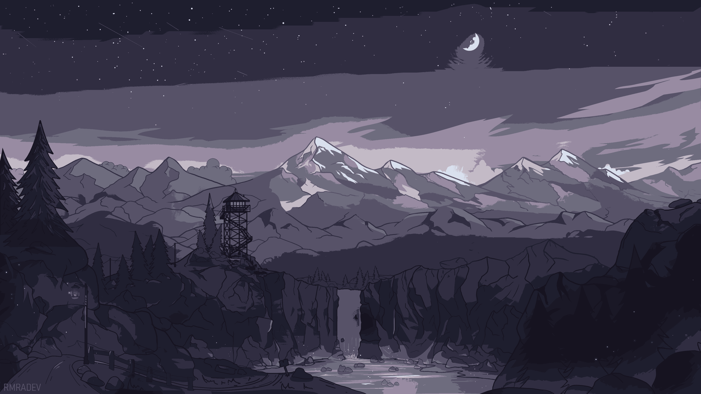

# Wallpapers: E - M

19 of 68 wallpapers in [`wallpapers/`](../wallpapers/). Sorted alphabetically.

[<< A - D](a-d.md) | [All wallpapers](index.md) | [N - R >>](n-r.md)

<table>
<tr>
  <td align="center"></td>
  <td align="center"></td>
  <td align="center"></td>
</tr>
<tr>
  <td align="center"><code>firewatch_purple.png</code></td>
  <td align="center"><code>goblin_slayer.jpg</code></td>
  <td align="center"><code>goldfish.jpg</code></td>
</tr>
<tr>
  <td align="center"></td>
  <td align="center"></td>
  <td align="center"></td>
</tr>
<tr>
  <td align="center"><code>hello-worlds.png</code></td>
  <td align="center"><code>home127-dark.jpg</code></td>
  <td align="center"><code>jellyfish.jpg</code></td>
</tr>
<tr>
  <td align="center"></td>
  <td align="center"></td>
  <td align="center"></td>
</tr>
<tr>
  <td align="center"><code>jupiter.png</code></td>
  <td align="center"><code>krita_digiart.png</code></td>
  <td align="center"><code>large_asf_goodbg.png</code></td>
</tr>
<tr>
  <td align="center"></td>
  <td align="center"></td>
  <td align="center"></td>
</tr>
<tr>
  <td align="center"><code>literal-wallpaper.png</code></td>
  <td align="center"><code>material_pastel_1.jpg</code></td>
  <td align="center"><code>material_pastel_2.jpg</code></td>
</tr>
<tr>
  <td align="center"></td>
  <td align="center"></td>
  <td align="center"></td>
</tr>
<tr>
  <td align="center"><code>material_pastel_3.jpg</code></td>
  <td align="center"><code>material_pastel_4.jpg</code></td>
  <td align="center"><code>material_pastel_5.jpg</code></td>
</tr>
<tr>
  <td align="center"></td>
  <td align="center"></td>
  <td align="center"></td>
</tr>
<tr>
  <td align="center"><code>material_pastel_6.jpg</code></td>
  <td align="center"><code>material_pastel_7.jpg</code></td>
  <td align="center"><code>material_pastel_8.jpg</code></td>
</tr>
<tr>
  <td align="center"></td>
  <td></td>
  <td></td>
</tr>
<tr>
  <td align="center"><code>melting_astro.jpg</code></td>
  <td></td>
  <td></td>
</tr>
</table>

[<< A - D](a-d.md) | [All wallpapers](index.md) | [N - R >>](n-r.md)
