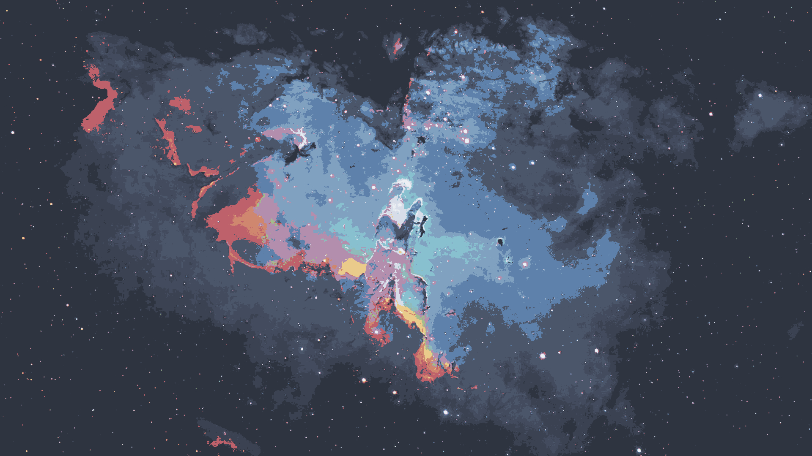

# Wallpapers: N - R

18 of 68 wallpapers in [`wallpapers/`](../wallpapers/). Sorted alphabetically.

[<< E - M](e-m.md) | [All wallpapers](index.md) | [S - Z >>](s-z.md)

<table>
<tr>
  <td align="center"></td>
  <td align="center"></td>
  <td align="center"></td>
</tr>
<tr>
  <td align="center"><code>mountain-snow-minima.jpg</code></td>
  <td align="center"><code>nasa1.png</code></td>
  <td align="center"><code>neon-singularity.jpg</code></td>
</tr>
<tr>
  <td align="center"></td>
  <td align="center"></td>
  <td align="center"></td>
</tr>
<tr>
  <td align="center"><code>nightTab_backdrop.jpg</code></td>
  <td align="center"><code>nord-chainsaw.png</code></td>
  <td align="center"><code>nord_car_live.gif</code></td>
</tr>
<tr>
  <td align="center"></td>
  <td align="center"></td>
  <td align="center"></td>
</tr>
<tr>
  <td align="center"><code>nord_minimal_cat.png</code></td>
  <td align="center"><code>nord_sky.jpeg</code></td>
  <td align="center"><code>pacman-black.png</code></td>
</tr>
<tr>
  <td align="center"></td>
  <td align="center"></td>
  <td align="center"></td>
</tr>
<tr>
  <td align="center"><code>pastel-car-girl.jpg</code></td>
  <td align="center"><code>pastel-car.png</code></td>
  <td align="center"><code>pastel-city.png</code></td>
</tr>
<tr>
  <td align="center"></td>
  <td align="center"></td>
  <td align="center"></td>
</tr>
<tr>
  <td align="center"><code>pixel-city.png</code></td>
  <td align="center"><code>pixel-earth.png</code></td>
  <td align="center"><code>planet_minimal.png</code></td>
</tr>
<tr>
  <td align="center"></td>
  <td align="center"></td>
  <td align="center"></td>
</tr>
<tr>
  <td align="center"><code>rain_world1.png</code></td>
  <td align="center"><code>rain_world2.png</code></td>
  <td align="center"><code>rm-rf.jpg</code></td>
</tr>
</table>

[<< E - M](e-m.md) | [All wallpapers](index.md) | [S - Z >>](s-z.md)
