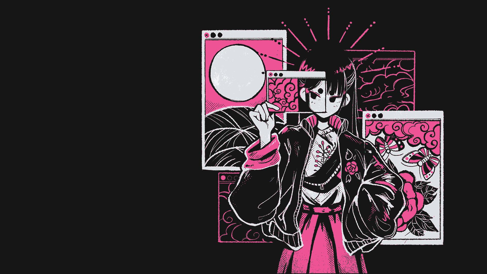
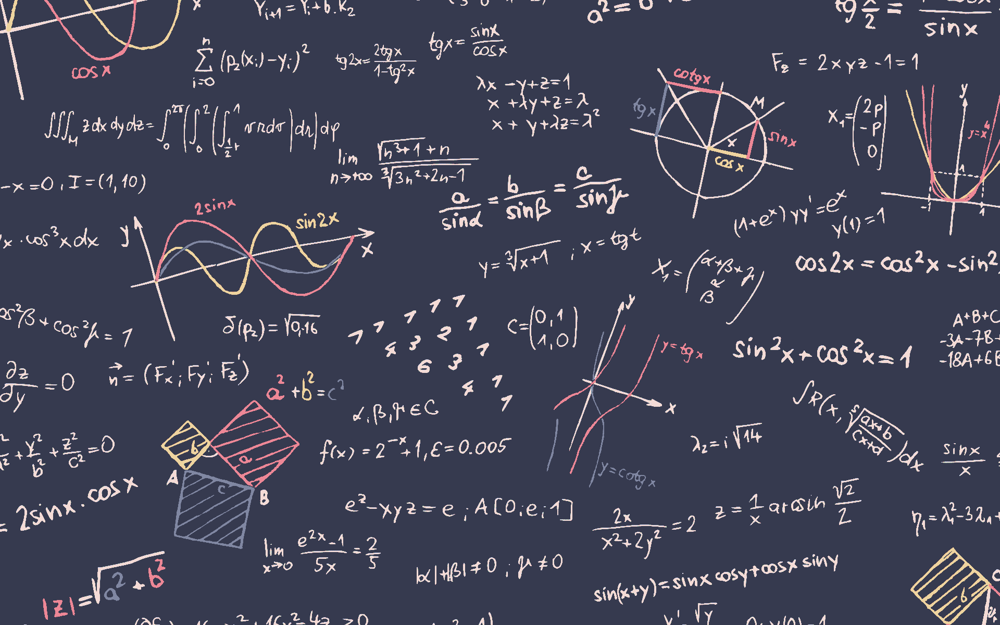
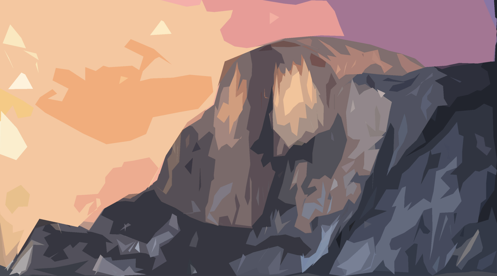

# Wallpapers: R - Y

25 of 102 wallpapers in [`wallpapers/`](../wallpapers/). Sorted alphabetically.

[<< M - R](m-r.md) | [All wallpapers](index.md)

<table>
<tr>
  <td align="center"></td>
  <td align="center"></td>
  <td align="center"></td>
</tr>
<tr>
  <td align="center"><code>rocket_launch.png</code></td>
  <td align="center"><code>sakura.jpg</code></td>
  <td align="center"><code>shiny-colors.png</code></td>
</tr>
<tr>
  <td align="center"></td>
  <td align="center"></td>
  <td align="center"></td>
</tr>
<tr>
  <td align="center"><code>shooting_stars.jpg</code></td>
  <td align="center"><code>siri.png</code></td>
  <td align="center"><code>space-juice.png</code></td>
</tr>
<tr>
  <td align="center"></td>
  <td align="center"></td>
  <td align="center"></td>
</tr>
<tr>
  <td align="center"><code>space_man.jpg</code></td>
  <td align="center"><code>space_piano.png</code></td>
  <td align="center"><code>sushi_dark.png</code></td>
</tr>
<tr>
  <td align="center"></td>
  <td align="center"></td>
  <td align="center"></td>
</tr>
<tr>
  <td align="center"><code>swords.jpg</code></td>
  <td align="center"><code>tabs.jpg</code></td>
  <td align="center"><code>think.png</code></td>
</tr>
<tr>
  <td align="center"></td>
  <td align="center"></td>
  <td align="center"></td>
</tr>
<tr>
  <td align="center"><code>train_tokyo.gif</code></td>
  <td align="center"><code>trigonometry.png</code></td>
  <td align="center"><code>two-astronauts.png</code></td>
</tr>
<tr>
  <td align="center"></td>
  <td align="center"></td>
  <td align="center"></td>
</tr>
<tr>
  <td align="center"><code>underwater.png</code></td>
  <td align="center"><code>vintage-ascent.jpg</code></td>
  <td align="center"><code>windows-black.png</code></td>
</tr>
<tr>
  <td align="center"></td>
  <td align="center"></td>
  <td align="center"></td>
</tr>
<tr>
  <td align="center"><code>windows-error.jpg</code></td>
  <td align="center"><code>windows-magenta-blue.png</code></td>
  <td align="center"><code>windows-magenta-pink.png</code></td>
</tr>
<tr>
  <td align="center"></td>
  <td align="center"></td>
  <td align="center"></td>
</tr>
<tr>
  <td align="center"><code>windows-xp.png</code></td>
  <td align="center"><code>xavier-cuenca-w4-3.jpg</code></td>
  <td align="center"><code>yosemite-color-block.png</code></td>
</tr>
<tr>
  <td align="center"></td>
  <td></td>
  <td></td>
</tr>
<tr>
  <td align="center"><code>yosemite-lowpoly.jpg</code></td>
  <td></td>
  <td></td>
</tr>
</table>

[<< M - R](m-r.md) | [All wallpapers](index.md)
