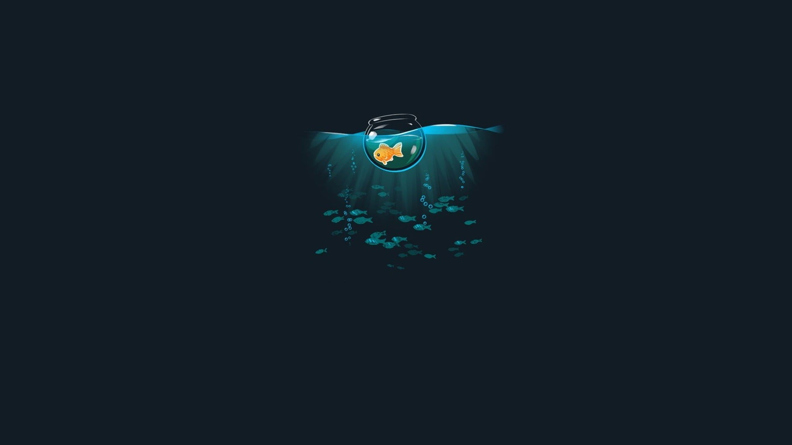
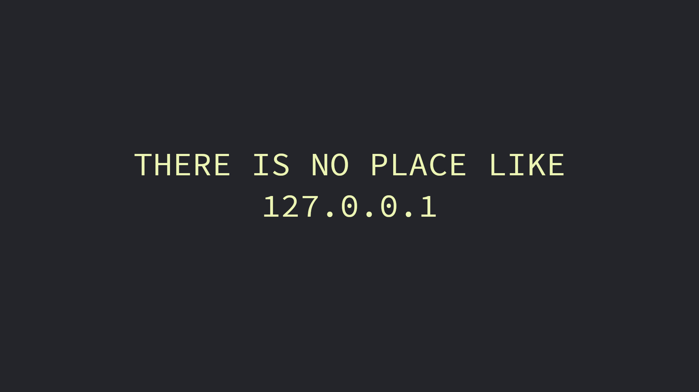
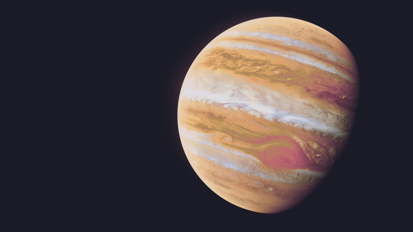
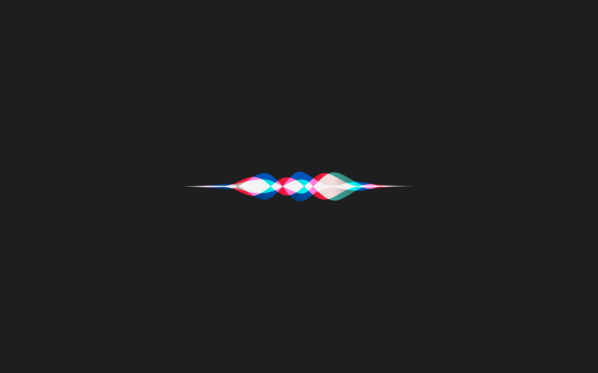
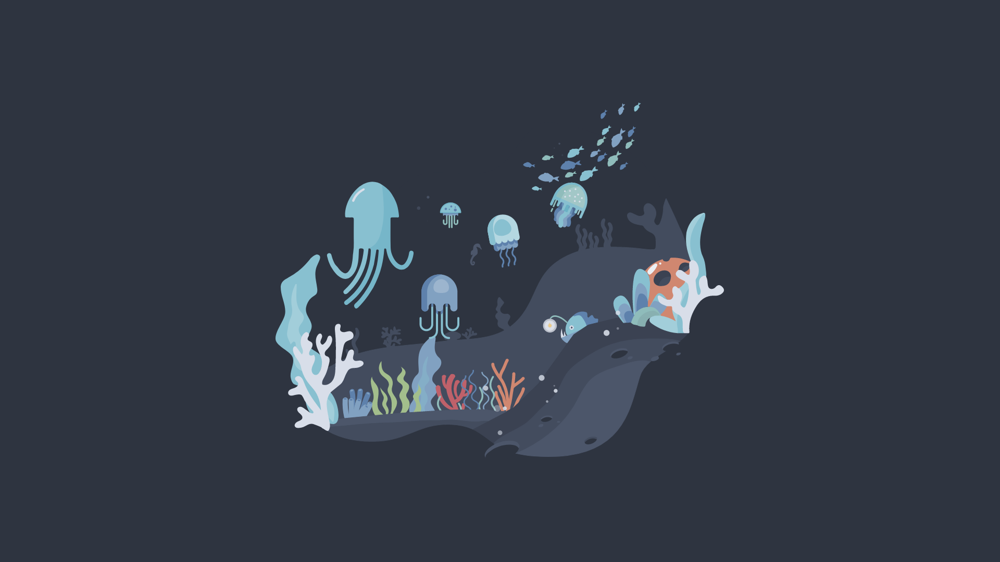

# Wallpapers

A gallery of all 41 wallpapers in [`wallpapers/`](wallpapers/).

<table>
<tr>
  <td align="center"></td>
  <td align="center"></td>
  <td align="center"></td>
</tr>
<tr>
  <td align="center"><code>anime_cafe_tokyonight.png</code></td>
  <td align="center"><code>anime_skyline.png</code></td>
  <td align="center"><code>astronaut.jpg</code></td>
</tr>
<tr>
  <td align="center"></td>
  <td align="center"></td>
  <td align="center"></td>
</tr>
<tr>
  <td align="center"><code>awesome.png</code></td>
  <td align="center"><code>black_car_girl.jpg</code></td>
  <td align="center"><code>camille-unknown.jpg</code></td>
</tr>
<tr>
  <td align="center"></td>
  <td align="center"></td>
  <td align="center"></td>
</tr>
<tr>
  <td align="center"><code>cat.jpg</code></td>
  <td align="center"><code>cliff-edge.jpg</code></td>
  <td align="center"><code>colorful-planets.jpg</code></td>
</tr>
<tr>
  <td align="center"></td>
  <td align="center"></td>
  <td align="center"></td>
</tr>
<tr>
  <td align="center"><code>deer-forest.jpg</code></td>
  <td align="center"><code>goldfish.jpg</code></td>
  <td align="center"><code>hello-worlds.png</code></td>
</tr>
<tr>
  <td align="center"></td>
  <td align="center"></td>
  <td align="center"></td>
</tr>
<tr>
  <td align="center"><code>home127-dark.jpg</code></td>
  <td align="center"><code>jellyfish.jpg</code></td>
  <td align="center"><code>jupiter.png</code></td>
</tr>
<tr>
  <td align="center"></td>
  <td align="center"></td>
  <td align="center"></td>
</tr>
<tr>
  <td align="center"><code>literal-wallpaper.png</code></td>
  <td align="center"><code>nasa1.png</code></td>
  <td align="center"><code>neon-singularity.jpg</code></td>
</tr>
<tr>
  <td align="center"></td>
  <td align="center"></td>
  <td align="center"></td>
</tr>
<tr>
  <td align="center"><code>nord-chainsaw.png</code></td>
  <td align="center"><code>nord_car_live.gif</code></td>
  <td align="center"><code>nord_minimal_cat.png</code></td>
</tr>
<tr>
  <td align="center"></td>
  <td align="center"></td>
  <td align="center"></td>
</tr>
<tr>
  <td align="center"><code>pacman-black.png</code></td>
  <td align="center"><code>pastel-car-girl.jpg</code></td>
  <td align="center"><code>pastel-car.png</code></td>
</tr>
<tr>
  <td align="center"></td>
  <td align="center"></td>
  <td align="center"></td>
</tr>
<tr>
  <td align="center"><code>pastel-city.png</code></td>
  <td align="center"><code>pixel-city.png</code></td>
  <td align="center"><code>pixel-earth.png</code></td>
</tr>
<tr>
  <td align="center"></td>
  <td align="center"></td>
  <td align="center"></td>
</tr>
<tr>
  <td align="center"><code>planet_minimal.png</code></td>
  <td align="center"><code>rm-rf.jpg</code></td>
  <td align="center"><code>shiny-colors.png</code></td>
</tr>
<tr>
  <td align="center"></td>
  <td align="center"></td>
  <td align="center"></td>
</tr>
<tr>
  <td align="center"><code>siri.png</code></td>
  <td align="center"><code>space-juice.png</code></td>
  <td align="center"><code>sushi_dark.png</code></td>
</tr>
<tr>
  <td align="center"></td>
  <td align="center"></td>
  <td align="center"></td>
</tr>
<tr>
  <td align="center"><code>swords.jpg</code></td>
  <td align="center"><code>two-astronauts.png</code></td>
  <td align="center"><code>underwater.png</code></td>
</tr>
<tr>
  <td align="center"></td>
  <td align="center"></td>
  <td align="center"></td>
</tr>
<tr>
  <td align="center"><code>windows-black.png</code></td>
  <td align="center"><code>windows-magenta-blue.png</code></td>
  <td align="center"><code>windows-magenta-pink.png</code></td>
</tr>
<tr>
  <td align="center"></td>
  <td align="center"></td>
  <td></td>
</tr>
<tr>
  <td align="center"><code>windows-xp.png</code></td>
  <td align="center"><code>yosemite-color-block.png</code></td>
  <td></td>
</tr>
</table>
